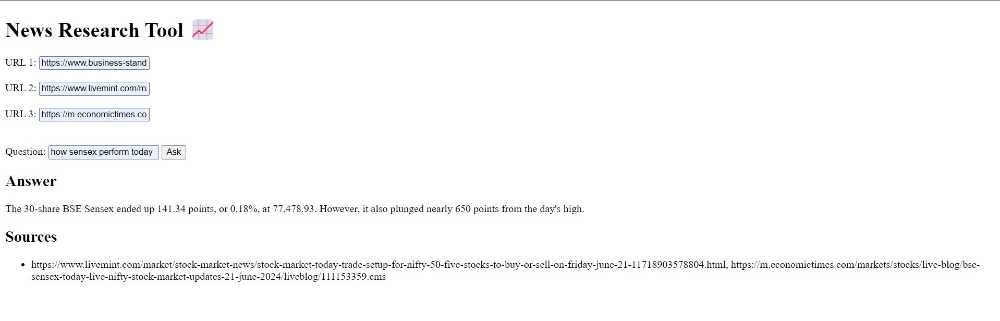

# News Research Tool (using flask)

Created a user-friendly news research tool designed for effortless information retrieval. Users can input article URLs and ask questions to receive relevant insights from the stock market and financial domain.



## Features

- Load URLs or upload text files containing URLs to fetch article content.
- Process article content through LangChain's UnstructuredURL Loader
- Construct an embedding vector using OpenAI's embeddings and leverage FAISS, a powerful similarity search library, to enable swift and effective retrieval of relevant information
- Interact with the LLM's (Chatgpt) by inputting queries and receiving answers along with source URLs.


## Installation

1. Install the required dependencies using pip:

```bash
  pip install -r requirements.txt
```
2.Set up your OpenAI API key by creating a .env file in the project root and adding your API

```bash
  OPENAI_API_KEY=your_api_key_here
```
## Usage/Examples

1. Run the flask app by executing:
```bash
run the app.py file

```

2.The web app will open in your browser.

- On the sidebar, you can input URLs directly.

- Initiate the data loading and processing by clicking "Ask"

- Observe the system as it performs text splitting, generates embedding vectors, and efficiently indexes them using FAISS.

- The embeddings will be stored and indexed using FAISS, enhancing retrieval speed.

- The FAISS index will be saved in a local file path in pickle format for future use.
- One can now ask a question and get the answer based on those news articles
- we used following news articles
  - https://www.business-standard.com/markets/news/stock-market-live-updates-today-june-21-sensex-nifty-ipo-block-deal-it-stocks-aster-dm-bajaj-cons-124062100089_1.html
  - https://www.livemint.com/market/stock-market-news/stock-market-today-trade-setup-for-nifty-50-five-stocks-to-buy-or-sell-on-friday-june-21-11718903578804.html
  - https://m.economictimes.com/markets/stocks/live-blog/bse-sensex-today-live-nifty-stock-market-updates-21-june-2024/liveblog/111153359.cms

## Project Structure

- app.py: contains flask application script.
- requirements.txt: A list of required Python packages for the project.
- faiss_store_openai.pkl: A pickle file to store the FAISS index.
- .env: Configuration file for storing your OpenAI API key.
